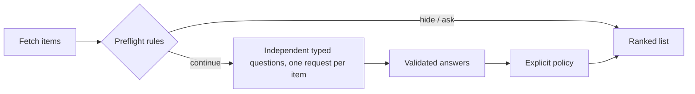

# living-filters

### Describe what deserves your attention.

"Show me issues I could fix this weekend." "Surface releases that could break my stack."

A living filter is a small file that says what you care about. `lf` fetches the candidates from GitHub, drops the obvious ones with free deterministic rules, asks [Jev](https://docs.typesafe.ai) one small judgment per remaining item, and prints a ranked list with a reason for every line. The file is the product: copy it, edit the profile, share it.

By [Really Artificial](https://github.com/ReallyArtificial) · JavaScript · Node.js 20.17+ · Zero dependencies · [MIT](LICENSE)

**Status:** v0.1.0. Two filters, eleven authored cases, all policy proven offline. Both filters have had one live run against real repositories with `jev-1.13.0`; the numbers, the answers and one contract bug it found are in [docs/first-live-run.md](docs/first-live-run.md). That is one run, not measured accuracy.

## Start in thirty seconds

```sh
git clone https://github.com/ReallyArtificial/living-filters.git
cd living-filters
npm run check                                   # policy tests + authored cases, no network
node src/cli.mjs run filters/weekend-fixes.filter.yaml   # dry run: fetch, preflight, count
```

The dry run needs a GitHub token for a sane rate limit. It uses `GITHUB_TOKEN` if set, otherwise `gh auth token`. No TypeSafe key is needed until you add `--live`.

```sh
cp .env.example .env            # set TYPESAFE_API_KEY
node src/cli.mjs run filters/weekend-fixes.filter.yaml --live --limit 5
```

`npm link` puts `lf` on your PATH if you prefer `lf run …`.

## The two filters

### weekend-fixes

Open issues across a list of repositories that the person in `profile` could plausibly fix in `hours`.

```yaml
name: weekend-fixes
kind: weekend-fixes
repos: [ReallyArtificial/freeport, ReallyArtificial/engram, ReallyArtificial/mcp-jest]
hours: 8
profile: |
  Comfortable in TypeScript and Node; rusty Python; no Rust or Go.
  About eight focused hours over a weekend. Prefers code over docs but will
  write docs for a tool I already use. Avoids UI work.
preflight:
  skip_labels: [wontfix, duplicate, invalid, in progress, blocked, needs discussion]
  skip_assigned: true
  stale_days: 365          # hide if 0 comments AND last updated longer ago than this
  max_body_chars: 1500
limits:
  max_judgments: 25
```

Per issue, Jev answers three independent questions: how well specified the work is (score), the effort for a contributor new to the codebase (choice), and whether the profile fits without learning a new stack (noul). The policy hides multi-day work and poor fits, asks for more information when a judgment is not confident or the fit is in the middle band, and ranks the rest by fit, effort and clarity.

### stack-breakers

Releases of the dependencies in a `package.json` that are newer than what is installed, judged against the `stack` you describe.

```yaml
name: stack-breakers-engram
kind: stack-breakers
project: ../../engram         # directory with package.json, relative to this file
include_dev: false
stack: |
  Node 20 ESM service. better-sqlite3 for storage, the MCP SDK for a stdio
  server, Vercel AI SDK v4 with the OpenAI provider, zod v3 at every boundary.
preflight:
  skip_prerelease: true
  patch_needs_keyword: true   # hide patch bumps unless the notes mention break/deprecat/remov/migrat/drop
  max_per_package: 3
  max_body_chars: 2500
limits:
  max_judgments: 25
```

The installed version comes from `node_modules`, else `package-lock.json` (v1, v2 and v3). The repository comes from the npm registry entry, and monorepo tags such as `ai@7.0.111` are matched to their package. Per release, Jev answers whether the notes describe a breaking change (choice), whether your stack touches that functionality (noul), and how large a migration the notes suggest (score). Additive releases hide; documented breaks in code you do not use hide; auto-generated commit lists ask for a real changelog.

## How a filter works



- **Preflight** is free and deterministic: labels, assignees, staleness, semver, keywords. Most items never reach the model.
- **Questions** are the [Jev primitives](docs/api-contract.md): `choice`, `score`, `noul`. Each names the state fields it reads and none refers to another answer.
- **Policy** is plain JavaScript you can read in `src/filters/<kind>/filter.mjs`. Every outcome is `show`, `needs-more-info` or `hide`, with a reason and a score that only orders items within an action.
- **Seen store.** Paid verdicts are kept in `~/.living-filters/seen/<name>.json`, keyed by item and its last update, so a rerun judges only what changed. `--all` re-judges everything.
- **Limitation.** For a monorepo, the releases endpoint returns the 50 newest releases across every package in it, so a package that releases rarely inside a busy monorepo can be missed.
- **Cap.** `--limit` (default `limits.max_judgments`) bounds paid requests per run. Items past the cap are listed under "needs more info" and picked up next run. Tokens and an estimated cost are printed after every live run.

## Fixture mode and live mode

Every filter ships with authored cases: a fixed item, hand-written answers, and the intended outcome. `lf cases weekend-fixes --check` runs them with no network and exits non-zero on a mismatch. These prove the policy, not the model. Fixture answers are illustrations, never recordings.

`lf request weekend-fixes --case small-clear-fit` prints the exact payload a case would send. Only `--live` calls the TypeSafe endpoint. When a live verdict disagrees with an authored expectation, that is evidence to inspect, not something to relabel.

## Commands

```
lf list
lf cases <kind|file.filter.yaml> [--check] [--json] [--live]
lf request <kind|file.filter.yaml> --case ID [--model ID]
lf run <file.filter.yaml> [--live] [--all] [--limit N] [--model ID] [--json] [--out FILE]
```

`run` without `--live` is a dry run: it fetches, applies preflight, lists what would be sent and how many requests that is. `--out` writes the JSON report and refuses to overwrite. The model defaults to `jev-1.13.0`; override with `--model` or `JEV_MODEL`.

## Config syntax

`.filter.yaml` files are read by a small parser with no dependencies. It supports exactly this and errors with a line number on anything else:

- two-space indentation, no tabs
- `key: value` scalars: `true`, `false`, integers, decimals, quoted or plain strings
- nested maps by indentation
- block lists (`- item`) of scalars or of one-level maps
- inline lists of scalars: `[a, b, "c d"]`
- `key: |` literal blocks for prose
- `#` comments

Not supported: `{}` inline maps, `>` folded blocks, anchors, multi-document files.

## Writing your own filter

A filter kind is one module in `src/filters/<kind>/filter.mjs` exporting `kind`, `summary`, `defaults`, `validateConfig`, `fetch`, `key`, `label`, `title`, `url`, `tags`, `preflight`, `state`, `questions`, `decide`, plus `cases` and `caseConfig` from a sibling `cases.mjs`. Register it in `src/filters/index.mjs`. Ship at least three authored cases, including one that stops at preflight, and add the policy branches to `test/filters.test.mjs` so that an inverted rule flips an assertion.

## Repository

```
filters/            shareable example configs
src/filters/        the two filter kinds, each with filter.mjs and cases.mjs
src/client.mjs      TypeSafe HTTP client (from jev-by-example)
src/contract.mjs    request and response validation (from jev-by-example)
src/runner.mjs      prepare, judge, cap, seen store loop, ranking
src/github.mjs      issues, releases, npm registry, lockfile lookup
src/yaml.mjs        the config parser
docs/api-contract.md
```

Related: [jev-by-example](https://github.com/ReallyArtificial/jev-by-example) for the judgment patterns this reuses, and [demon](https://github.com/ReallyArtificial/demon) if you want a process that watches and acts rather than a list to read.
